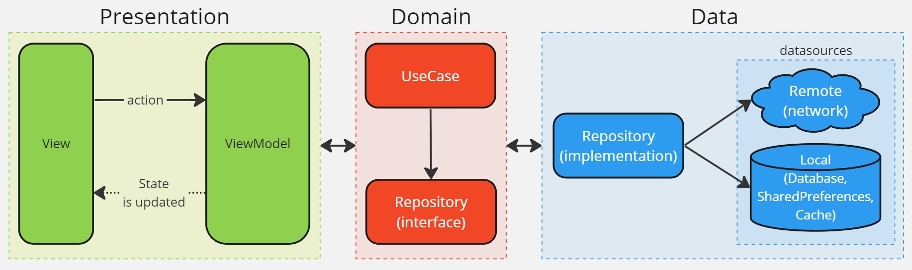

# Rankings

## Introduction

Flutter app which gives the user the ability to consult rankings. By entering a query in the search bar, the app leverages [ChatGPT](https://chatgpt.com/) for detailed information and [DALL·E](https://openai.com/index/dall-e/) for visually compelling representations, generating personalized and engaging rankings.

This project showcases **Clean Architecture** in Flutter, utilizing the MVVM design pattern.




## Screenshots


## Features

- Clean Architecture
- HTTP client to API REST ([Dio](https://pub.dev/packages/dio))
- Internationalization translations ([Easy localization](https://pub.dev/packages/easy_localization))
- Routing ([Go Router](https://pub.dev/packages/go_router))
- MVVM pattern with [Cubit](https://pub.dev/packages/flutter_bloc) for state management
- Dependency injection ([Get it](https://pub.dev/packages/get_it) and [Injectable](https://pub.dev/packages/injectable)).
- Environment configuration (dev, prod)

## Environment

The application has two environments and each one has its own configuration file:

- dev: `.env/dev.json`
- prod: `.env/prod.json`

Inside each one, you can find sensitive information that shouldn't be committed to this repository. Due to this, these configuration files cannot be uploaded to this repository. Please, add your own `dev.json` and `prod.json` inside `.env` folder with the following structure and **replace the API key** with your own [OpenAI API](https://openai.com/api/) key.

```
{
    "ENVIRONMENT": "prod",
    "API_KEY": "OPENAI_API_KEY",
    "BASE_URL": "api.openai.com"
}
```

## Run and build

To run the application in each environment, you can use the following commands:

- dev: `flutter run --dart-define-from-file=.env/dev.json`
- prod: `flutter run --dart-define-from-file=.env/prod.json`

Also, you can configure your IDE to run the application in each environment.

## OpenAI configuration

If you want to change the ChatGPT model, the maximum number of tokens per request, or any other [OpenAI API](https://platform.openai.com/) parameters, you can modify these settings in `lib\data\datasources\ranking\ranking_chatgpt_datasource_implementation.dart.`

This can be useful, for instance, to reduce API costs, adjust the resolution of generated images, or tweak the "creativity" of ChatGPT responses by modifying the `temperature` parameter.
